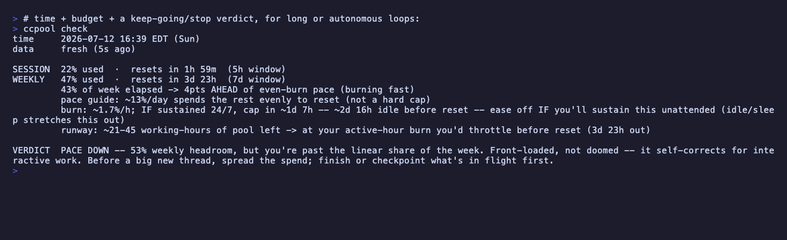

# ccpool

**How much of your weekly Claude pool is left, in dollars, and are you burning it too fast?**

Your usage tools show a percentage and a reset time. ccpool tells you what that percentage is *worth*,
whether you're ahead of pace, and when you'll actually run dry. It reads the account-global
`rate_limits` % that [`ccusage`](https://github.com/ccusage/ccusage) structurally can't see and
delegates every dollar to ccusage: **complementary to ccusage and native `/status`, not a replacement.**


- **See your real budget:** the account-global % turned into `$ left of your weekly pool` plus a pace
  verdict, in your statusline and `ccpool status`.
- **Spend it wisely:** `ccpool run -- <cmd>` auto-downshifts subagent model/effort (`opus/high` to
  `haiku/low`) when you're burning ahead of pace, so an unattended loop conserves the pool.
- **Know when to stop:** `ccpool check` gives a keep-going/stop verdict plus a working-hours runway for
  long or autonomous loops.

## Install

ccpool is a single static Go binary. The `%`, pace, burn, and warnings need nothing; only the `$`
readout shells out to `ccusage` (which needs Node/`npx`), and it degrades gracefully to `%`-only if
that's absent.

```sh
go install github.com/SeanLF/ccpool@latest          # or pin a version: @v0.1.0
# or grab a prebuilt binary from the GitHub Releases page
brew install SeanLF/tap/ccpool                      # Homebrew (stable); bleeding-edge: SeanLF/tap/ccpool-beta
# or: make build && export PATH="$PWD:$PATH"

ccpool init --apply                   # wires it into Claude Code; zero config, backup taken first
```


`ccpool init` is the whole setup: it adds the `statusLine` command plus the mid-turn `warn` hooks to
`~/.claude/settings.json`. **Dry-run by default** (run it without `--apply` to see the exact diff),
**idempotent**, **never-clobber** (it merges alongside your other hooks, never replaces them), and
**symlink-aware** (it follows a dotfiles-symlinked `settings.json` to the real target). Then use Claude
Code as normal; the statusline self-populates ccpool's local store on every render. To fully unwire
later, remove the `statusLine` and `hooks` entries `init` added (or set `"enabled": false`, below, to
mute it without touching `settings.json`).

## What each command does

`ccpool status` fuses the account-global `rate_limits` % with a ccusage-calibrated `$/1%` into a
**dollar value for your weekly pool** plus a pace verdict: *"9% used · ~$2,329 left of ~$2,560
(API-equiv) · resets Wed 21:00 · 20pts under pace, burn freely."*

`ccpool check` is time plus budget plus a keep-going/stop **verdict** for long or autonomous loops
(`KEEP GOING` / `PACE DOWN` / `SESSION-LIMITED` / `WIND DOWN` / `COAST` / `BURN DOWN`), distinguishing a
temporary 5h throttle from a real "stop for the week." It includes a **working-hours runway**:
time-to-exhaustion measured per *active* hour, so sleep doesn't dilute it.



`ccpool run -- <cmd>` runs `<cmd>`, **downshifting subagent model/effort** when you're burning ahead of
pace, so an unattended `/loop` or fan-out conserves the pool. Verified: it sets
`CLAUDE_CODE_SUBAGENT_MODEL` and `CLAUDE_CODE_EFFORT_LEVEL`, which actually take effect on spawned
subagents.

`ccpool review [days]` is a retrospective: **did you use the right model for the work?** It flags
expensive-model turns that did trivial work (candidates to downshift). I haven't seen another tool
surface this.

`ccpool warn` is a Claude Code hook (`UserPromptSubmit` / `PostToolUse`) that warns the agent mid-turn
when it's over pace, near the 5h cap, or near context auto-compaction.

`ccpool rhythm` (read-only) reads your last 30d of transcripts in the *current* machine's local time and
measures rhythm strength `R`. High `R` means a sharp day/night rhythm, so it suggests a concrete
`CCPOOL_WAKE_HOURS` (plus `CCPOOL_WORK_DAYS`); low `R` means continuous loops fill the clock, so it says
stick with `even`. A suggester, never an auto-applier. Tune with `CCPOOL_RHYTHM_WINDOW` / `CCPOOL_RHYTHM_R`.

It **fails open** on any missing or stale data, so it never blocks Claude Code. Run `ccpool <command>
--help` for details on any command.

## Keep your statusline: compose, don't replace

ccpool is a *specialized pool gauge*, not a general statusline (it deliberately shows no model/git/dir,
that's your host statusline's job). So if you already run one, add ccpool *inside* it.
[ccstatusline](https://github.com/sirmalloc/ccstatusline) forwards Claude's full payload (incl.
`rate_limits`) to its **Custom Command** widgets, so ccpool renders natively as a widget:

```
# in ccstatusline's config, add a Custom Command widget with command:
ccpool statusline --embed
```

`--embed` prints just ccpool's differentiator, `pool 45% $1.4k +2↑` (weekly % · $-of-pool left · pace),
and leaves ctx/5h/model/git to the host. `ccpool init` auto-detects a ccstatusline statusLine and prints
this recipe instead of offering to replace it. The `$` self-populates even if ccpool is *only* ever a
widget: each render kicks off a throttled background calibration warm-up (never blocking the line).
(claude-powerline and CCometixLine don't forward the payload or don't take external commands, so there
ccpool has to be the statusLine: `ccpool init --replace-statusline`.)

Doing it by hand instead of via `init`:

```jsonc
// ~/.claude/settings.json
{ "statusLine": { "type": "command", "command": "ccpool statusline" } }
```

Run `ccpool statusline` **bare in a terminal** to preview the line (it renders from the freshest stored
snapshot instead of hanging on stdin).

## Pace profiles (env)

Pace is `used%` vs how far through the week you *should* be. By default that's the plain elapsed fraction
of the rolling 7-day window: uniform 24/7, which fits a continuous autonomous-loop operator. But the
window's start is arbitrary (Anthropic-controlled) and few humans burn evenly, so a Mon-Fri worker would
look "ahead of pace" every Friday for no real reason. Describe your rhythm with two orthogonal knobs (off
either one falls to the `CCPOOL_PACE_FLOOR` residual, not zero, so one late night isn't read as
infinitely ahead of pace):

| knob | default | meaning |
|---|---|---|
| `CCPOOL_WORK_DAYS` | `0-6` (all) | which days you're active (wday `0`=Sun … `6`=Sat) |
| `CCPOOL_WAKE_HOURS` | `0-24` (no sleep) | your waking window on those days |
| `CCPOOL_PACE_FLOOR` | `0.15` | weight for off-days / sleeping hours |

Examples: **24/7 loop operator**, *defaults*. **9-5 human**, `WORK_DAYS=1-5 WAKE_HOURS=9-17`. **7-day
indie who sleeps**, `WAKE_HOURS=8-24`. **4-day week**, `WORK_DAYS=1-4 WAKE_HOURS=8-24`.

`CCPOOL_PACE_PROFILE` is optional shorthand that just presets those knobs: `even` (default, all/24h),
`weekdays` (`1-5`/24h), `workhours` (`1-5`/`9-17`), or `custom` for graded `CCPOOL_PACE_WEIGHTS` (7,
Sun-Sat) × `CCPOOL_PACE_HOUR_WEIGHTS` (24). An explicit knob overrides the preset. One setting steers
`status`, `check`, `warn`, `run`'s downshift, and the statusline bar together, so they can't disagree.

## Config file

ccpool reads a config file at `~/.ccpool/ccpool.json` (override `CCPOOL_CONFIG`). Zero-config still
works; every setting has a default, and the file just persists your choices so they survive without
keeping env vars exported. Resolution order is **env > file > default**: env stays the override, the file
is where a chosen or detected value lives. A realistic file:

```jsonc
{
  "enabled": true,
  "pace":      { "profile": "workhours", "work_days": "1-5", "wake_hours": "9-17" },
  "downshift": { "mode": "auto", "model": "haiku", "effort": "low" },
  "clock":     "24",
  "colour":    "truecolor",
  "tier":      "max_20x",
  "history":   { "keep_days": 30, "min_interval": 60 }
}
```

`enabled: false` is a kill-switch: the statusline and `warn` hook go quiet (no-op) without unwiring
anything from `settings.json`, handy for a holiday or a focus block.

**Commands.** `ccpool config show` prints the effective value of every setting plus which layer supplied
it (`env`/`file`/`default`): the "why is my pace X?" answer. `ccpool config init` seeds the file (dry-run
by default; `--apply` writes it fill-missing-only, `--apply --force` re-detects and overwrites).
`ccpool init --apply` also seeds the config as part of first-time setup, so a single command wires the
hooks *and* the file. Detection is off the hot path (only `init`/`config init` run it, never a render);
the threshold escape hatches (`CCPOOL_CHECK_*`/`WARN_*`/`RUNWAY_*`, below) are deliberately **not** in the
file, since they're power-user overrides on internal judgment calls, not user-shape settings.

## Config (env)

| var | default | meaning |
|---|---|---|
| `CCPOOL_PACE_MARGIN` | `3` | pts over pace before `run` downshifts / `warn` nags |
| `CCPOOL_DOWNSHIFT` | `auto` | `auto` (enforce) · `advise` (print, don't apply) · `off` |
| `CCPOOL_DOWNSHIFT_MODEL` / `_EFFORT` | `haiku` / `low` | what to downshift subagents to |
| `CCPOOL_CALIB_TTL` | `21600` | seconds to cache the `$/1%` calibration |
| `CCPOOL_CCUSAGE_CMD` | `npx -y ccusage@20` | how to invoke ccusage (pinned major; see internal/calib) |
| `CCPOOL_HISTORY_KEEP_DAYS` | `30` | `prune --history` cutoff; `0` = keep forever |
| `CCPOOL_HISTORY_MIN_INTERVAL` | `60` | min seconds between 5h-only history writes |
| `CCPOOL_CLOCK` | `24` | wall-clock format: `24` · `12` · `auto` (best-effort OS detect, macOS-only) |
| `NO_COLOR` / `TERM=dumb` | unset | standard [no-color.org](https://no-color.org) contract: strips all ANSI |
| `CCPOOL_HOME`, `CCPOOL_DB` | `~/.ccpool`, `$HOME/ccpool.db` | ccpool state dir + SQLite store path |

## Limitations

- **Downshift is launch-time** (per `ccpool run` invocation), not continuous mid-run. Claude Code hooks
  can't set model/effort, so the wrapper is the enforcement point. The right grain for an unattended
  fan-out; it won't slow a single expensive main-loop turn.
- **`$` values are API-equivalent**, not billed money (you pay a flat subscription). The right signal for
  "burn it or bank it," not for accounting. Self-calibrated from *your* usage; drifts with model mix or
  promos (recomputed every `CCPOOL_CALIB_TTL`).
- **Single data source.** It reads the statusline snapshot; no OAuth fallback. It stamps data age when
  stale and is robust to the known leak bug (#52326), but it's one source, not ccusage's three-tier
  hierarchy (yet).
- **`seven_day` is only the ALL-MODELS weekly window.** Anthropic tracks *separate* per-model weekly caps
  (a Sonnet-only one, [#27915](https://github.com/anthropics/claude-code/issues/27915), and a distinct
  Fable bucket) that `/status` shows but that are **not** in the `rate_limits` payload ccpool reads. So
  you could hit a per-model cap with ccpool showing the main pool healthy. Treat a healthy weekly % as
  necessary-but-not-sufficient for model-heavy work and check `/status`.
- **`review` proxies effort** from output-token volume plus tool-call count (effort isn't logged
  per-turn); `ultrathink`/thinking inflate output invisibly. Treat it as a hint, not a verdict.

## Acknowledgements

ccpool stands on other people's work:

- **[ccusage](https://github.com/ccusage/ccusage)** (@ryoppippi) is the authoritative `$` engine. ccpool
  delegates every dollar to it and never hand-rolls pricing.
- **[ccstatusline](https://github.com/sirmalloc/ccstatusline)** (@sirmalloc) is the composable statusline
  ccpool embeds into as a `--embed` widget.
- **[vhs](https://github.com/charmbracelet/vhs)** (Charm) records the demo GIFs above.

Independent and unofficial, **not affiliated with Anthropic**. ccpool reads Claude Code's local data and
the `rate_limits` number Anthropic already reports; it never circumvents any limit.

## Tests

```sh
make check    # gofumpt + vet + staticcheck + govulncheck + go test ./...
```

Conformance suites diff every command's output against committed golden files (hermetic `CCPOOL_*` env,
no `~/.claude` access). ccusage is mocked in tests via `CCPOOL_CCUSAGE_CMD`.
